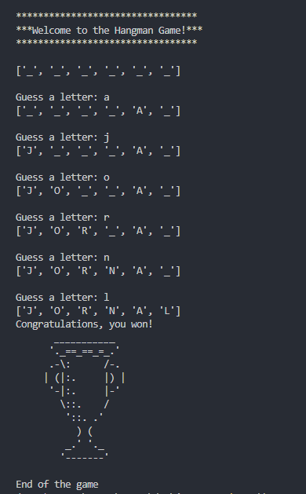
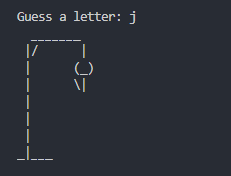
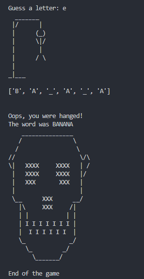

# Hangman Game in Python

A simple hangman game implemented in Python and execute on terminal, where words are randomly chosen from a local `.txt` file.

The game displays the letters of the word as they are discovered and, in case of error, displays parts of the construction of a doll with each error. 
This happens until the game is lost because the doll was completely built, or the game is won by completely discovering the letters of the word.

### Example of success:
<h6 align="left">
  
</h6>

### Example of doll construction:
<h6 align="left">
  
</h6>

### Example of loss:
<h6 align="left">
  
</h6>

## Getting started

### Prerequisites
 - Python 3.x
 - Terminal or Command Prompt

### Installation

1. Clone the repository to your local machine:

```
git clone https://github.com/your-username/python-hangman-cli.git
```

### Running the game

1. Execute the game by running the following command in your terminal:

```
python hangman.py
```

2. Follow the on-screen instructions to play the game.

## Customizing Word List
You can customize the word list by editing the `words.txt` file. Add one word per line, and the game will randomly select words from this list.
